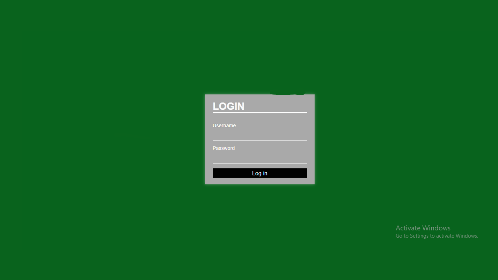

# Data-Penduduk

# Deskripsi Aplikasi 
- Aplikasi ini merupakan Project Akhir sebagai syarat kelulusan Sertifikasi Digital Telent sebagai "Junior Web Developer"
- Aplikasi ini adalah Aplikasi Sistem Informasi yang dapat digunakan untuk mendata Warga yang dilengkapi dengan beberapa Fitur seperti Login, Input Data, daftar warga, edit dan cetak kartu data diri warga.

# Gambar Project

DATABASE

